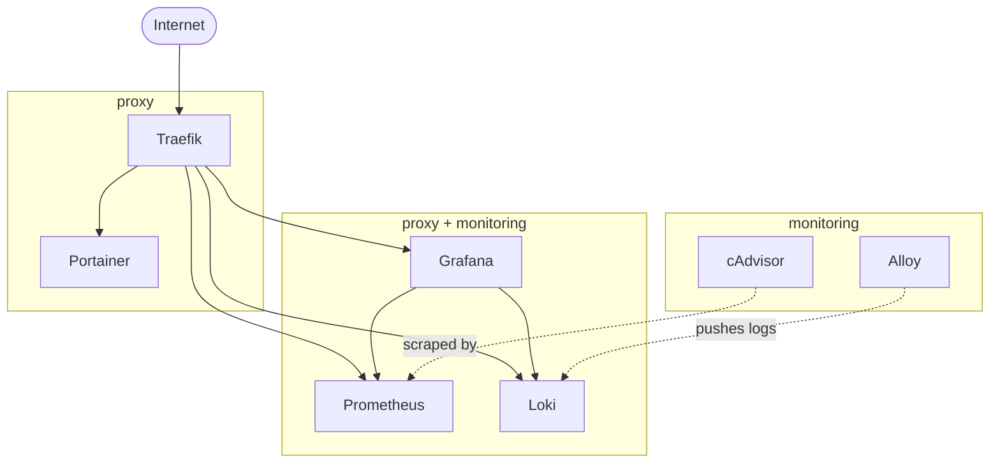

# DevOps Learning Server

A single server running Docker Compose with a reverse proxy, monitoring, logging, and container management.

Built as a practical learning project for my path into DevOps during my retraining in software development.

A family cloud and a backend for my own game are planned, with the infrastructure already in place for them.

## Services

| Service | Version | Purpose |
|---|---|---|
| Traefik | v3.7.7 | Routes traffic to containers, TLS and Let's Encrypt |
| Portainer CE | 2.39.4 | Manages containers over a web interface |
| Prometheus | v3.5.5 | Collects metrics and stores them as time series |
| Grafana OSS | 13.1.0 | Shows metrics and logs in dashboards |
| Loki | 3.7.3 | Stores logs, counterpart of Prometheus |
| Alloy | v1.18.1 | Collects logs from containers and sends them to Loki |
| cAdvisor | v0.57.0 | Collects metrics from running containers |
| Node Exporter | 1.12.0 | Collects metrics from host: CPU, RAM, Disk, Network |

Note on Node Exporter: It runs as a systemd service, not in a container. Running it containerized would require host network and PID namespace access, which removes most of the isolation. The official documentation recommends running it on the host.


## Docker networks

The system uses two networks to keep the public entry point separate from the monitoring services.

A service uses `proxy` when it should be reachable from outside, and `monitoring` when it talks to other services. Some do both.

Traefik is only connected to `proxy`, so it cannot reach containers that are only connected to `monitoring`. With one shared network, a wrong Traefik label could make a service reachable from outside.

Traefik, Portainer, Prometheus, Grafana and Loki use `proxy`. Prometheus, Grafana and Loki also use `monitoring`. cAdvisor and Alloy only use `monitoring`.

`providers.docker.network: proxy` tells Traefik which network to use for containers that are connected to more than one. Without it, Traefik could pick the wrong address.





## Access and protection

Traefik listens on ports 80 and 443 and is reachable from the internet. Services using `vpn-only` are restricted by an IP allowlist in Traefik, not by the Docker network. The protection depends on this middleware. A new service without `vpn-only` is publicly reachable.

All routed services use `secured@file`, but it only adds headers and compression. It does not provide authentication.

Grafana does not use `vpn-only` and is publicly reachable. Access to Grafana is handled by its own login.

Prometheus and Loki use `monitoring-auth` in addition to `vpn-only`. The Traefik dashboard uses `dashboard-auth`. Portainer has no BasicAuth in front of it. The IP allowlist and Portainer's own login are the only protection.

The admin subdomains (`traefik`, `portainer`, `prometheus` and `loki`) need to point to `10.10.10.1` in the client's hosts file. Without these entries, public DNS points to the public IP. The request then reaches Traefik with the client's public IP, which is not in `10.10.10.0/24`, resulting in `403`.


## Requirements

### Docker

Docker with compose plugin.


### Networks

These networks are declared in the compose files. Compose expects them but does not create them. Without them, every `docker compose up` fails.
```bash
docker network create proxy
docker network create monitoring
```


### DNS

All subdomains need an A record pointing to the server's public IP. The subdomains are traefik, portainer, prometheus, loki and grafana.

This also applies to the services that are only reachable over VPN. Traefik requests the certificates over the HTTP challenge, and Let's Encrypt validates from the outside. Without a public DNS record, no certificate is issued.

The stack still starts if a record is missing. The error only shows in the Traefik log.


## Deployment

### Environment files

Five stacks need a `.env`: traefik, grafana, loki, portainer and prometheus. All of them set `DOMAIN`. Traefik also sets `ACME_EMAIL` for Let's Encrypt. Alloy and cAdvisor don't need one, because they have no subdomain.

Compose only reads a `.env` file from the directory of the compose file. That is why each stack has its own. Each stack has a `.env.example` next to its compose file.

Example with Traefik:
```bash
cp traefik/.env.example traefik/.env
```
The other stacks work the same way.

If `DOMAIN` is not set, Compose replaces it with an empty value. The Traefik router then gets an invalid rule and the service is not reachable. Compose only shows a warning on startup.


### Secrets

The three secret files are not in the repository. Also the `secrets/` directories do not exist after cloning and must be created.

| File | Content |
|---|---|
| `traefik/secrets/dashboard_auth_users` | htpasswd lines, bcrypt |
| `traefik/secrets/monitoring_auth_users` | htpasswd lines, bcrypt |
| `grafana/secrets/admin_password` | password in plain text |

```bash
mkdir -p traefik/secrets grafana/secrets
```


#### BasicAuth files

`dashboard_auth_users` protects the Traefik dashboard. `monitoring_auth_users` protects Prometheus and Loki.

`htpasswd` is part of the `apache2-utils` package on Debian and Ubuntu.

```bash
htpasswd -B -c traefik/secrets/dashboard_auth_users <username>
htpasswd -B -c traefik/secrets/monitoring_auth_users <username>
```

`-B` forces bcrypt. `-c` creates a new file.

For a second user in the same file, skip `-c`, otherwise the file is overwritten.


#### Grafana admin password

```bash
read -rs -p "Grafana admin password: " GF_PW && printf '%s' "$GF_PW" > grafana/secrets/admin_password && unset GF_PW
chmod 600 grafana/secrets/admin_password
```

Grafana does not read the file, the entrypoint script of the image does. This shows in the first log line on startup, before Grafana's own logger. This is why the `__FILE` convention works on `GF_SECURITY_ADMIN_PASSWORD__FILE`.


### Grafana dashboards

`node-exporter-full.json` is not in the repository. The dashboard ID on Grafana.com is 1860 and the file must be placed in `grafana/provisioning/dashboards/json/`.

The cAdvisor dashboard is self-built, which is why it is in the repository.

In `dashboards.yml`, `disableDeletion` is set to `false`. If a JSON file is removed, Grafana deletes the dashboard from its database.

The database is in `grafana/data/` and is not versioned. Users and dashboards created through the web interface are not in the repository.


### Startup order

Start Traefik first. After that the other stacks can be started in any order.

Starting another stack first also works. Traefik picks it up through the Docker provider when it starts.


## Known pitfalls

Node Exporter is not part of this repository. It runs natively on the host and must be installed there, otherwise the scrape target stays down.

Grafana runs as UID 472. The data directory must be owned by this UID.

Grafana produces two `level=error` lines on every start, because it cannot update two bundled plugins. This is expected and has no effect.


## What's missing

### Observability

- Prometheus collects metrics from itself, Node Exporter and cAdvisor. Metrics from Traefik, Loki, Grafana and Alloy are not collected.
- Alloy collects only Traefik logs. Other container logs have to be checked with `docker logs`.
- There is no blackbox monitoring for external service availability.

### Security


- Secrets are stored in plain text on the server. There is no secret manager or encrypted storage yet. SOPS or Vault could be added later.
- Portainer uses its own login and an IP allowlist. There is no BasicAuth in Traefik.
- Portainer has direct access to the Docker socket without `:ro`.
- cAdvisor runs with `privileged: true`. The exact requirement for this is not documented yet.
- Traefik and Alloy have direct access to the Docker socket. No Docker socket proxy is used.
- There is no fail2ban or CrowdSec. Grafana is publicly reachable.


### Operations

- Host configuration is not versioned. This includes `daemon.json`, the Node Exporter service, WireGuard and UFW. The WireGuard server configuration contains a private key and should only be stored as an `.example` file.
- There is no update policy yet. Image versions are maintained manually. Node Exporter is also installed manually instead of through a package manager.
- Grafana downloads plugins from the internet when starting. These are not pinned like the container images.
- There are no ADRs for infrastructure decisions such as VPN access, native Node Exporter or public Grafana.
- Backups need to include both `/var/lib/docker/` and `/var/lib/containerd/`.