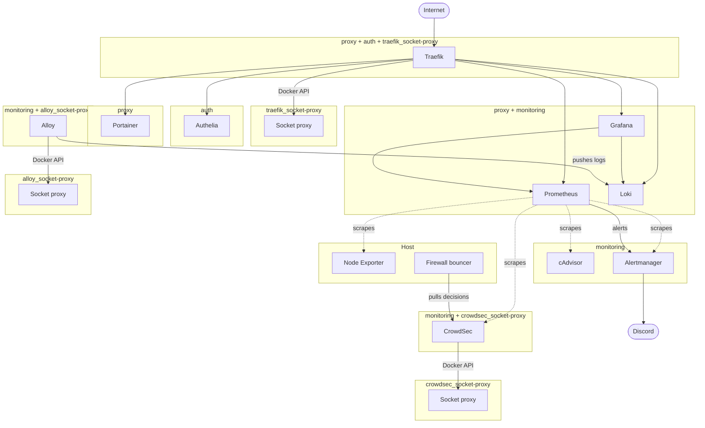

# DevOps Learning Server

A single server running Docker Compose with a reverse proxy, authentication, monitoring, alerting, logging, intrusion prevention and container management.

Built as a practical learning project for my path into DevOps during my retraining in software development.

A family cloud and a backend for my own game are planned, with the infrastructure already in place for them.

## Services

| Service | Version | Purpose |
|---|---|---|
| Traefik | v3.7.13 | Routes traffic to containers, TLS and Let's Encrypt |
| Authelia | 4.39.22 | Forward-auth for routed services, login portal and TOTP |
| Portainer CE | 2.39.4 | Manages containers over a web interface |
| Prometheus | v3.13.2 | Collects metrics and stores them as time series, evaluates alert rules |
| Alertmanager | v0.34.1 | Groups alerts from Prometheus and sends them to Discord |
| Grafana OSS | 13.1.0 | Shows metrics and logs in dashboards |
| Loki | 3.7.3 | Stores logs, counterpart of Prometheus |
| Alloy | v1.18.1 | Collects logs from containers and sends them to Loki |
| cAdvisor | v0.57.0 | Collects metrics from running containers |
| CrowdSec | v1.8.1 | Detects attacks in SSH, Traefik and Authelia logs |
| Socket proxy (wollomatic) | 1.12.3 | Limits Docker API access for Traefik, Alloy and CrowdSec |

Running directly on the host:

| Component | Version | Purpose |
|---|---|---|
| Node Exporter | 1.12.1 | Collects metrics from host: CPU, RAM, Disk, Network |
| CrowdSec Firewall Bouncer | v0.0.36 | Drops traffic from IPs banned by CrowdSec in nftables |

Note on Node Exporter: It runs as a systemd service, not in a container. Running it containerized would require host network and PID namespace access, which removes most of the isolation. The official documentation recommends running it on the host.

Note on the firewall bouncer: It changes the nftables rules of the host, so it runs on the host. The CrowdSec package repository had no packages for Ubuntu 26.04 when this was set up. The bouncer is installed from the official GitHub release, with the SHA256 checksum verified.


## Docker networks

Each trust boundary gets its own Docker network. A container is only connected to the networks it needs.

Containers that do not need to communicate with each other should not be able to reach each other.

| Network | Purpose |
|---|---|
| `proxy` | Public entry point |
| `monitoring` | Metrics and logs between services |
| `auth` | Traefik and Authelia only |
| `traefik_socket-proxy` | Traefik and its socket proxy only |
| `alloy_socket-proxy` | Alloy and its socket proxy only |
| `crowdsec_socket-proxy` | CrowdSec and its socket proxy only |

`proxy`, `monitoring` and `auth` are marked as `external`, so Compose expects them to already exist and does not create them. The three socket proxy networks are created by Compose together with their stack and are `internal`, so they have no route to the outside.

| Service | Networks |
|---|---|
| Traefik | `proxy`, `auth`, `traefik_socket-proxy` |
| Authelia | `auth` |
| Portainer | `proxy` |
| Grafana, Prometheus, Loki | `proxy`, `monitoring` |
| cAdvisor, Alertmanager | `monitoring` |
| Alloy | `monitoring`, `alloy_socket-proxy` |
| CrowdSec | `monitoring`, `crowdsec_socket-proxy` |
| Socket proxies | only their own `*_socket-proxy` network |

Authelia stays on its own `auth` network. This prevents other containers on `proxy` from reaching its port 9091 directly. The forward-auth endpoint is only reachable by Traefik at the network level. This follows the same network separation used for `monitoring`: cAdvisor, Alertmanager, Alloy and CrowdSec are not reachable by Traefik, regardless of an accidental Traefik label.

CrowdSec is on `monitoring` so that Prometheus can scrape its metrics on port 6060. `monitoring` is not `internal`, which CrowdSec also needs to download its hub content and the community blocklist.

`providers.docker.network: proxy` in `traefik.yml` sets the default network for the Docker provider. Authelia overrides it with the label `traefik.docker.network=auth`. Without this label, Traefik would look for Authelia on `proxy`, but Authelia is not connected to that network.




## Access and protection

Traffic passes several layers. Each one only stops what reaches it.

### Outside Traefik

The Hetzner Cloud Firewall allows inbound ICMP, TCP 80 and 443 and UDP 51820 (WireGuard). Everything else is dropped before it reaches the server.

The CrowdSec firewall bouncer drops traffic from banned IPs in nftables, on the `input` and `forward` hooks, before Docker's rules. This also covers requests to the bare IP, which match no Traefik router and never see a middleware. Bans come from CrowdSec's own detection and from the community blocklist. An allowlist named `trusted` contains the VPN subnet and the Docker bridge subnets, so the server cannot ban its own VPN or internal traffic.

UFW denies everything by default. It allows 80, 443 and 51820/udp. SSH (22/tcp) is only allowed on `wg0` from `10.10.10.0/24`, so SSH works only over WireGuard. Node Exporter on port 9100 is only allowed from the `monitoring` subnet. The Hetzner web console is the fallback when the VPN is not available.

Traefik is the only container that publishes ports to the outside (80 and 443). CrowdSec publishes its local API on `127.0.0.1:8080` for the bouncer only.

### Traefik middlewares

`secured` is attached to the `websecure` entry point, so it wraps every router, including `401` and `403` responses from other middlewares. It sets security headers and enables compression. The headers are `X-Content-Type-Options: nosniff`, `Referrer-Policy: strict-origin-when-cross-origin` and HSTS for one year with `includeSubDomains`, without `preload`. `secured` does not provide authentication.

`frame-deny` sets `X-Frame-Options: DENY`. It is a separate middleware instead of a global header, so a future service can still be embedded.

`admin` is a chain of `frame-deny` and `vpn-only`. `vpn-only` is an IP allowlist for `10.10.10.0/24`. It works on the HTTP layer in Traefik, not on the Docker network. A new service without `admin` is publicly reachable.

| Router | Middlewares |
|---|---|
| Traefik dashboard | `admin`, `dashboard-auth` |
| Portainer | `admin` |
| Prometheus, Loki | `admin`, `monitoring-auth` |
| Grafana | `rate-limit`, `frame-deny`, `authelia` |
| Grafana login (`/api/auth/signin`, priority 100) | `login-rate-limit`, `frame-deny`, `authelia` |
| Authelia portal | `rate-limit`, `frame-deny` |

`dashboard-auth` and `monitoring-auth` are BasicAuth. Portainer has no BasicAuth in front of it. The IP allowlist and Portainer's own login are the only protection.

`rate-limit` allows an average of 30 requests per second with a burst of 100. A cold start of Grafana in the browser was measured at 45 parallel requests in one second, and the Authelia portal peaked at 18 per second. `login-rate-limit` allows 6 requests per minute with a burst of 5 on Grafana's login endpoint, where failed login attempts from scanners were seen.

### Grafana and Authelia

Grafana is publicly reachable on purpose, for demonstration. It is protected by Authelia through forward-auth, followed by Grafana's own login. These are two separate logins by design, not single sign-on.

Authelia bans a client IP for 15 minutes after three failed logins. A session ends after 5 minutes of inactivity. Authelia uses the filesystem notifier, so notifications such as the one for TOTP registration are written to `authelia/data/notification.txt` instead of being sent by mail.

### Admin subdomains over VPN

The admin subdomains (`traefik`, `portainer`, `prometheus` and `loki`) need to point to `10.10.10.1` in the client's hosts file. Without these entries, public DNS points to the public IP. The request then reaches Traefik with the client's public IP, which is not in `10.10.10.0/24`, resulting in `403`. There is no DNS resolver on the VPN interface yet, which is why the hosts file is used.


## Requirements

### Host

Built and tested on:

| Component | Version |
|---|---|
| Server | Hetzner Cloud CX43, 8 vCPU, 15 GiB RAM |
| OS | Ubuntu 26.04.1 LTS |
| Docker Engine | 29.8.1 |
| Docker Compose | v5.5.1 |

Nothing in this setup depends on this exact combination. Other Linux distributions with a current Docker Engine and the Compose plugin should work, but are not tested. The `adm` group with GID 4 is Debian-specific.

Each stack lives in its own directory under `/opt/` on the server, with the same name as in this repository.

### Host configuration

`host/` mirrors the paths on the server:

| File | Purpose |
|---|---|
| `host/etc/systemd/system/node_exporter.service` | Node Exporter unit with systemd hardening |
| `host/etc/rsyslog.d/40-crowdsec-auth.conf` | Writes auth messages to `/var/log/crowdsec/auth.log` |
| `host/etc/logrotate.d/crowdsec-auth` | Rotation for that file |

WireGuard, UFW, the Hetzner Cloud Firewall and the firewall bouncer configuration are not part of this repository. See [What's missing](#whats-missing).

### Host users

Traefik runs as the host system user `traefik`. Its UID and GID go into `traefik/.env`. `traefik/letsencrypt/` must be owned by this user with mode `0700`, and `acme.json` with mode `0600`. The BasicAuth files are owned by `root` with group `traefik` and mode `0640`.

Alloy runs as UID and GID 473, the user the image is built for. A host user `alloy` with these fixed IDs owns `alloy/data/`.

The socket proxies run as `nobody` (65534) with the group of the Docker socket, which is set as `DOCKER_GID`.

### Networks

These networks are declared in the compose files. Compose expects them but does not create them. Without them, every `docker compose up` fails.
```bash
docker network create proxy
docker network create monitoring
docker network create auth
```

The socket proxy networks are created by Compose and need no manual step.

### DNS

All subdomains need an A record pointing to the server's public IP. The subdomains are traefik, portainer, prometheus, loki, grafana and auth.

This also applies to the services that are only reachable over VPN. Traefik requests the certificates over the HTTP challenge, and Let's Encrypt validates from the outside. Without a public DNS record, no certificate is issued.

The stack still starts if a record is missing. The error only shows in the Traefik log.

Alertmanager and CrowdSec have no subdomain.


## Deployment

### Environment files

Compose only reads a `.env` file from the directory of the compose file. That is why each stack has its own. Each stack that needs one has a `.env.example` next to its compose file.

| Stack | Variables |
|---|---|
| authelia, grafana, loki, portainer, prometheus | `DOMAIN` |
| traefik | `DOMAIN`, `ACME_EMAIL`, `TRAEFIK_UID`, `TRAEFIK_GID`, `DOCKER_GID` |
| alloy, crowdsec | `DOCKER_GID` |

cAdvisor and Alertmanager don't need one.

Example with Traefik:
```bash
cp traefik/.env.example traefik/.env
chmod 600 traefik/.env
```
The other stacks work the same way.

All variables are used as `${VAR:?}`. If a value is missing or empty, Compose stops with an error instead of starting with an empty value.

`TRAEFIK_UID`, `TRAEFIK_GID` and `DOCKER_GID` depend on the host, because a system user and the `docker` group get the next free ID when they are created. The comments in the `.env.example` files show the command for each value. `DOCKER_GID` is in three files, because each stack only reads its own `.env`.

`${...}` only works in compose files. `traefik.yml` is read by Traefik itself, so variables are not replaced there. Traefik gets `ACME_EMAIL` through the environment variable `TRAEFIK_CERTIFICATESRESOLVERS_LETSENCRYPT_ACME_EMAIL`, which Traefik maps to the matching key of its static configuration.

Prometheus uses `DOMAIN` for `--web.external-url`, so links in alerts point to `https://prometheus.<domain>`. They open over VPN only.

Authelia's `configuration.yml` uses Authelia's template filter instead. `X_AUTHELIA_CONFIG_FILTERS=template` enables it, and the compose file passes `DOMAIN` into the container. Authelia replaces `{{ mustEnv "DOMAIN" }}` when it starts, before the file is parsed. `mustEnv` fails if the variable is not set. Compose always passes `DOMAIN`, even when it is empty, so the `:?` in the compose file is what stops an empty value. `docker exec authelia authelia config template --config /config/configuration.yml` shows the rendered file.


### Secrets

Secret files are not in the repository. The `secrets/` directories do not exist after cloning and must be created.

| File | Content |
|---|---|
| `traefik/secrets/dashboard_auth_users` | htpasswd lines, bcrypt |
| `traefik/secrets/monitoring_auth_users` | htpasswd lines, bcrypt |
| `grafana/secrets/admin_password` | password in plain text |
| `authelia/secrets/jwt_secret` | random string |
| `authelia/secrets/session_secret` | random string |
| `authelia/secrets/storage_encryption_key` | random string |
| `authelia/config/users_database.yml` | users with argon2 password hashes |
| `alertmanager/secrets/discord_webhook_url` | Discord webhook URL |

```bash
mkdir -p traefik/secrets grafana/secrets authelia/secrets alertmanager/secrets
chmod 700 authelia/secrets alertmanager/secrets
```


#### BasicAuth files

`dashboard_auth_users` protects the Traefik dashboard. `monitoring_auth_users` protects Prometheus and Loki.

`htpasswd` is part of the `apache2-utils` package on Debian and Ubuntu.

```bash
htpasswd -B -c traefik/secrets/dashboard_auth_users <username>
htpasswd -B -c traefik/secrets/monitoring_auth_users <username>
sudo chown root:traefik traefik/secrets/dashboard_auth_users traefik/secrets/monitoring_auth_users
sudo chmod 640 traefik/secrets/dashboard_auth_users traefik/secrets/monitoring_auth_users
```

`-B` forces bcrypt. `-c` creates a new file.

For a second user in the same file, skip `-c`, otherwise the file is overwritten.


#### Grafana admin password

```bash
read -rs -p "Grafana admin password: " GF_PW && printf '%s' "$GF_PW" > grafana/secrets/admin_password && unset GF_PW
chmod 600 grafana/secrets/admin_password
```

Grafana does not read the file, the entrypoint script of the image does. This shows in the first log line on startup, before Grafana's own logger. This is why the `__FILE` convention works on `GF_SECURITY_ADMIN_PASSWORD__FILE`.


#### Authelia secrets

```bash
docker run --rm -u 1000:1000 -v "$PWD/authelia/secrets:/secrets" authelia/authelia:4.39.22 \
  authelia crypto rand /secrets/jwt_secret /secrets/session_secret /secrets/storage_encryption_key
```

`authelia crypto rand` writes each file with a separate random value, 72 alphanumeric characters, mode `0600`.

`storage_encryption_key` encrypts sensitive values in `data/db.sqlite3`, including TOTP registrations. It has to be backed up together with the database. Without it, the encrypted values cannot be read.

`users_database.yml` is in `config/`, which is mounted read-only. It starts as a copy of the example:

```bash
cp authelia/config/users_database.example.yml authelia/config/users_database.yml
```

Password hashes are generated with:

```bash
docker run -it --rm authelia/authelia:4.39.22 authelia crypto hash generate argon2
```


#### Discord webhook

Alertmanager reads the URL through `webhook_url_file` from a Compose secret. The file must be readable by UID 65534.

```bash
read -rs -p "Discord webhook URL: " WH_URL && printf '%s' "$WH_URL" > alertmanager/secrets/discord_webhook_url && unset WH_URL
chmod 400 alertmanager/secrets/discord_webhook_url
sudo chown 65534:65534 alertmanager/secrets/discord_webhook_url
```


### CrowdSec

The host configuration from `host/` has to be in place first. The log file must exist before CrowdSec starts reading it. Copy both files to the same paths under `/etc` and restart rsyslog.

CrowdSec reads the auth log from its own directory `/var/log/crowdsec/` instead of a single mounted file. A single-file bind mount follows the inode, so after logrotate creates a new file, the container would keep reading the old one.

The engine reads the logs of Traefik and Authelia through its socket proxy, which only allows the `GET` endpoints it needs. It joins group 4 (`adm`) to read the auth log. It shares signals with the CrowdSec community and receives the community blocklist in return. Console enrollment is off.

The firewall bouncer needs an API key from the engine. The install script looks for `cscli` on the host, does not find it because the engine runs in a container, and leaves a placeholder. The key is created with:

```bash
docker exec crowdsec cscli -oraw bouncers add firewall-bouncer
```

It goes into `api_key` in `/etc/crowdsec/bouncers/crowdsec-firewall-bouncer.yaml`, with `api_url: http://127.0.0.1:8080/`. Then the bouncer service can be started. The key must not end up in the repository or in the shell history.

The allowlist `trusted` is created with `cscli` in the engine and is not in the repository.


### Alerting

Alert rules are in `prometheus/rules/`:

| File | Rules |
|---|---|
| `targets.yml` | `TargetDown`: a scrape target is down for 2 minutes |
| `node-filesystem.yml` | Four filesystem rules adapted from the node-mixin of Node Exporter |

Unit tests for the rules are in `prometheus/tests/` and run with promtool from the Prometheus image:

```bash
docker run --rm --entrypoint promtool \
  -v /opt/prometheus/rules:/prometheus-config/rules:ro \
  -v /opt/prometheus/tests:/prometheus-config/tests:ro \
  prom/prometheus:v3.13.2 test rules /prometheus-config/tests/targets.test.yml
```

Prometheus reloads its configuration and rules on `SIGHUP`:

```bash
docker kill --signal=HUP prometheus
```

Alertmanager groups alerts by name and sends them to Discord, including resolved alerts. A critical filesystem alert mutes the matching warning. Alertmanager has no published port and no Traefik route. High availability is disabled, so the cluster port is not opened.


### Grafana dashboards

`node-exporter-full.json` is not in the repository. The dashboard ID on Grafana.com is 1860 and the file must be placed in `grafana/provisioning/dashboards/json/`.

The cAdvisor dashboard is self-built, which is why it is in the repository.

In `dashboards.yml`, `disableDeletion` is set to `false`. If a JSON file is removed, Grafana deletes the dashboard from its database.

The database is in `grafana/data/` and is not versioned. Users and dashboards created through the web interface are not in the repository.


### Startup order

Start Traefik first. After that the other stacks can be started in any order.

Starting another stack first also works. Traefik picks it up through the Docker provider when it starts.

Grafana depends on Authelia. Without a running Authelia container, Traefik cannot complete the forward-auth check and Grafana is not reachable.

The rsyslog configuration from `host/` comes before CrowdSec, and CrowdSec before the firewall bouncer.


## Known pitfalls

Node Exporter is installed manually on the host from the official release. The unit file is in `host/`, the binary is not. Without it, the scrape target stays down.

Grafana runs as UID 472. The data directory must be owned by this UID.

Grafana produces two `level=error` lines on every start, because it cannot update two bundled plugins. This is expected and has no effect.

Authelia runs as UID/GID 1000 (`user: "1000:1000"`). `data/` must be writable and `secrets/` readable by this UID.

Authelia does not start if a secret is set twice, for example as a `_FILE` variable and in `configuration.yml`, or if the configuration contains an unknown key. `docker exec authelia authelia config validate --config /config/configuration.yml` checks the file on disk before a restart.

Prometheus and Alertmanager run as UID/GID 65534. Their `data/` directories must be owned by this UID, with mode `0700`.

Alertmanager v0.34.1 does not log when it loads its configuration. The metric `alertmanager_config_last_reload_successful` shows whether the last reload worked.

Traefik's file provider logs unknown keys as `ERR` and keeps the last valid configuration. The log has to be checked after every change in `dynamic/`.

Traefik only routes to a container with a healthcheck once it is healthy. A `404` shortly after a restart is expected.

If the Docker package is reinstalled, the `docker` group can get a different GID. `DOCKER_GID` then has to be updated in all three `.env` files.


## What's missing

### Observability

- Prometheus collects metrics from itself, Node Exporter, cAdvisor, CrowdSec and Alertmanager. Metrics from Traefik, Loki, Grafana and Alloy are not collected.
- Alerts only cover down targets and filesystems. There is no dead man's switch, so nothing reports when Prometheus or Alertmanager itself is down.
- Alloy collects only Traefik logs. Other container logs have to be checked with `docker logs`.
- There is no blackbox monitoring for external service availability.

### Security

- Secrets are stored in plain text on the server. There is no secret manager or encrypted storage yet. SOPS or Vault could be added later.
- Deliberate exception: Portainer has full access to the Docker API through the socket. It is only reachable over VPN.
- Deliberate exception: cAdvisor runs as root with the host filesystem mounted recursively under `/rootfs`, which includes the Docker and containerd sockets. It is only on the `monitoring` network.
- Deliberate exception: the CrowdSec engine runs as root, with a read-only filesystem, no capabilities and `no-new-privileges`.
- Portainer uses its own login and an IP allowlist. There is no BasicAuth in Traefik.
- Metrics endpoints have no authentication. They are only reachable on the `monitoring` network.
- Prometheus, Alertmanager and the socket proxies share UID 65534.
- Requests to the bare IP match no router and get a `404` without any middleware. Only the firewall and CrowdSec apply there.

### Operations

- Host configuration is only partly versioned. Not in the repository: UFW rules, the Hetzner Cloud Firewall, WireGuard, the firewall bouncer configuration with its API key, the CrowdSec allowlist and `daemon.json`. The WireGuard server configuration contains a private key and should only be stored as an `.example` file. The cloud firewall could later be managed with OpenTofu or Terraform.
- There is no update policy yet. Image versions are maintained manually. Node Exporter and the firewall bouncer are installed manually from release archives instead of through a package manager.
- Grafana downloads plugins from the internet when starting. These are not pinned like the container images.
- There are no ADRs for infrastructure decisions such as VPN access, native Node Exporter, public Grafana or the firewall bouncer instead of a Traefik plugin.
- There is no backup strategy yet. A backup needs the bind-mounted data under `/opt` (at least `grafana/data/`, `authelia/data/` and `authelia/secrets/`) in addition to `/var/lib/docker/` and `/var/lib/containerd/`. `storage_encryption_key` must be backed up with `db.sqlite3`.


## Direction

The target platform for this project is Kubernetes, using k3s.

The current Docker Compose setup is a deliberate first stage: understand the infrastructure and its concepts before moving to a different platform.

Some decisions will be revisited there. cAdvisor is built into the kubelet, and the CrowdSec Traefik plugin will be evaluated instead of relying only on the firewall bouncer.

The migration will be documented alongside the existing setup rather than replacing it, so both stages and their differences remain visible.